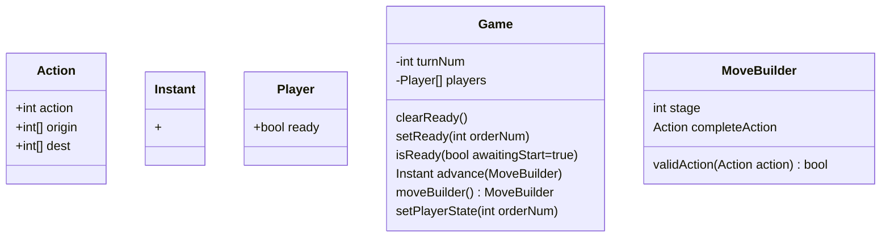

```mermaid
classDiagram

class Action{
    +int action
    +int[] origin
    +int[] dest
}

class Instant {
 +
}

class Player{
    +bool ready
}

class Game{
    -int turnNum
    -Player[] players
    clearReady()
    setReady(int orderNum)
    isReady(bool awaitingStart=true)
    Instant advance(MoveBuilder)
    moveBuilder() MoveBuilder
    setPlayerState(int orderNum)
}

class MoveBuilder{
    int stage
    Action completeAction
    validAction(Action action) bool
}

```
